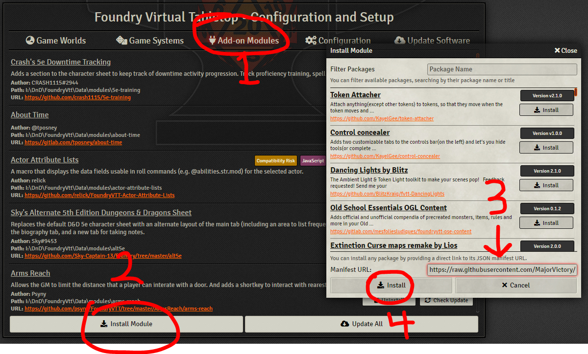
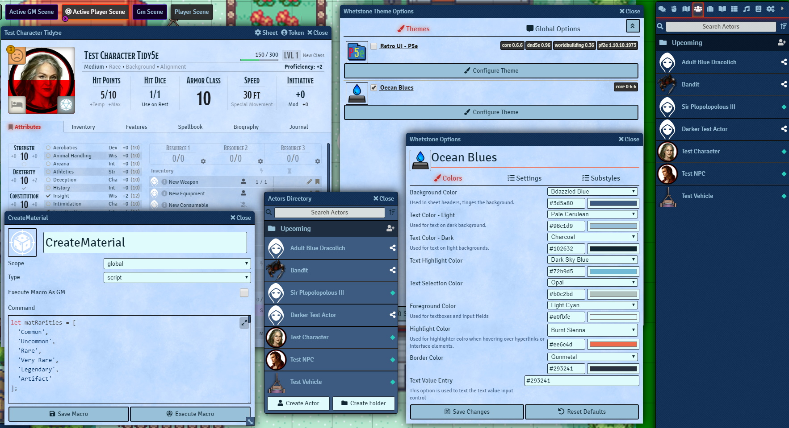
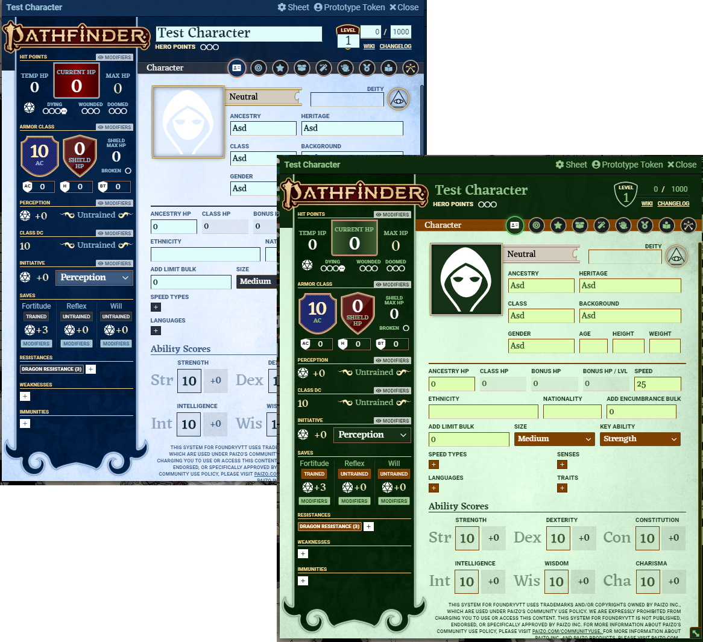

[![foundry-shield]][foundry-url]
[![Forks][forks-shield]][forks-url]
[![Stargazers][stars-shield]][stars-url]
[![Issues][issues-shield]][issues-url]

 

  
  <h3 align="center">Whetstone - Foundry Theme Manager</h3>
  

    A module designed to make applying and customizing themes easier for users and theme authors.
  

  

    Users can apply multiple themes at once, configure colors, and any theme related settings.
  

  

    Theme authors can create everything from simple fixes for specific elements, to entire UI overhauls with system-dependant styles.
  

  

     
    <a href="https://github.com/MajorVictory/Whetstone/wiki/Whetstone:-FoundryVTT-Theme-Manager">Read the Whetstone Wiki</a> | <a href="https://github.com/MajorVictory/Whetstone/issues">Report Bugs / Request Features</a>
  

## Installation

### Requirements

**[Core Compatibility]**:
 * *FoundryVTT* 0.6.5-0.6.6

**[Known Issues]**
 * [Report Problems](https://github.com/MajorVictory/Whetstone/issues)

### Latest Release

You can download the module in it's current state by pasting the following manifest url into Foundry or search for `Whetstone` in the module browser.

> https://raw.githubusercontent.com/MajorVictory/Whetstone/master/module.json

## More Themes !?

### Theme Authors

Themes can be published as normal modules with a depedency listed for Whetstone. Users install your theme through the module browser as normal and enable them via Whetstone's config.

### List of Themes

[I will maintain a short list of themes in the wiki.](https://github.com/MajorVictory/Whetstone/wiki/List-of-Themes#-list-of-whetstone-themes-)

Contact me via discord, make a bug report, or submit a pull request if you want your theme listed there.

## Changelog

[Previous Versions Changelog](CHANGELOG.md)

## Screenshots 

Comes with a prebuilt style: OceanBlues

## License

Whetstone is a module for Foundry VTT by Majorvictory and is licensed under a [Creative Commons Attribution 4.0 International License](http://creativecommons.org/licenses/by/4.0/).

This work is licensed under Foundry Virtual Tabletop [EULA - Limited License Agreement for module development from May 29, 2020](https://foundryvtt.com/article/license/).

[foundry-shield]: https://img.shields.io/badge/Foundry-v0.6.6-informational
[foundry-url]: https://foundryvtt.com/
[forks-shield]: https://img.shields.io/github/forks/MajorVictory/Whetstone.svg?style=flat-square
[forks-url]: https://github.com/MajorVictory/Whetstone/network/members
[stars-shield]: https://img.shields.io/github/stars/MajorVictory/Whetstone.svg?style=flat-square
[stars-url]: https://github.com/MajorVictory/Whetstone/stargazers
[issues-shield]: https://img.shields.io/github/issues/MajorVictory/Whetstone.svg?style=flat-square
[issues-url]: https://github.com/MajorVictory/Whetstone/issues