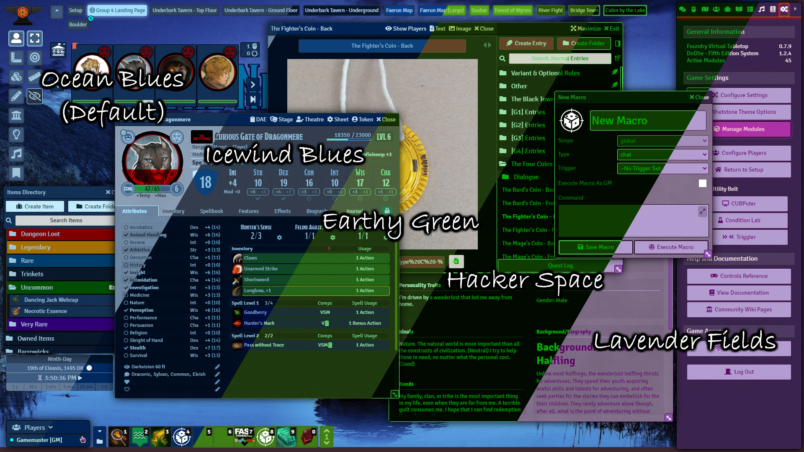
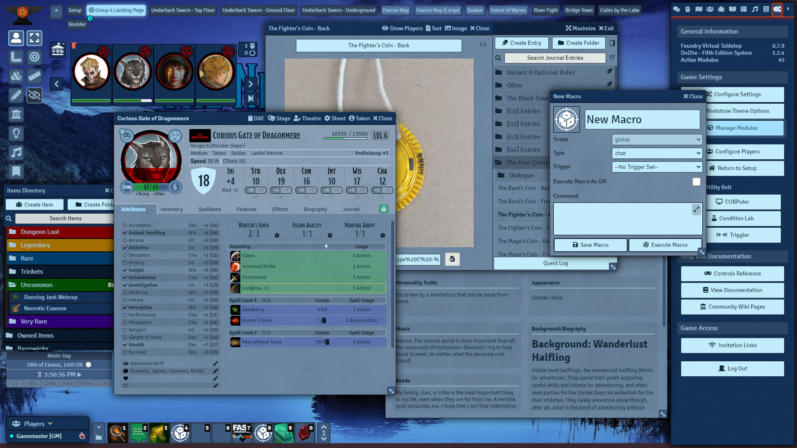
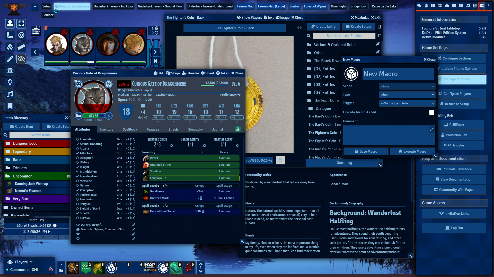
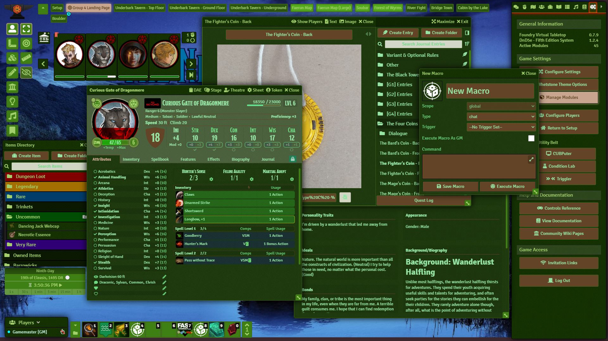
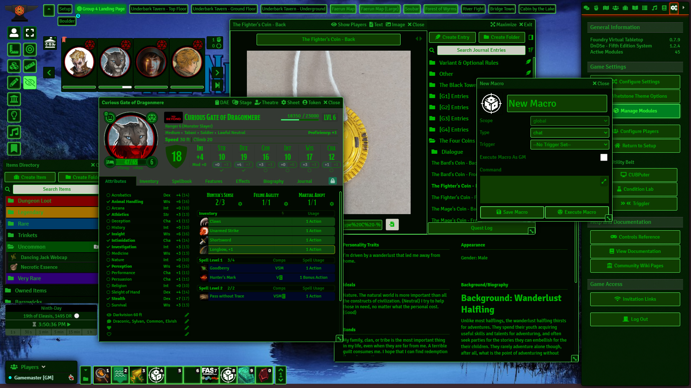
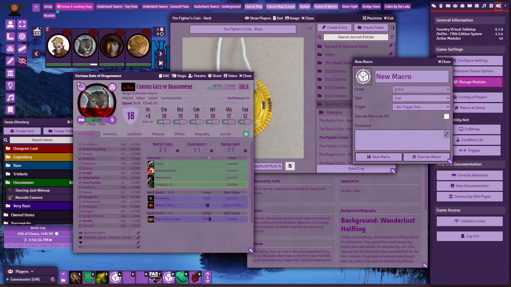

[![foundry-shield-066]][foundry-url]
[![foundry-shield-079]][foundry-url]
[![Forks][forks-shield]][forks-url]
[![Stargazers][stars-shield]][stars-url]
[![Issues][issues-shield]][issues-url]

 

  
  <h3 align="center">Whetstone - Foundry Theme Manager</h3>
  

    A module designed to make applying and customizing themes easier for users and theme authors.
  

  

    Users can apply multiple themes at once, configure colors, and any theme related settings.
  

  

    Theme authors can create everything from simple fixes for specific elements, to entire UI overhauls with system-dependant styles.
  

  

     
    <a href="https://github.com/MajorVictory/Whetstone/wiki/Whetstone:-FoundryVTT-Theme-Manager">Read the Whetstone Wiki</a> | <a href="https://github.com/MajorVictory/Whetstone/issues">Report Bugs / Request Features</a>
  

## Screenshots 

The provided Ocean Blues theme comes with 5 pre-made color sets:

### Ocean Blues (Default)

### Ocean Blues (Icewind Blues)

### Ocean Blues (Earthy Green)

### Ocean Blues (Hacker Space)

### Ocean Blues (Lavender Fields)

## Installation

### Requirements

**[Core Compatibility]**:
 * *FoundryVTT* 0.6.5-0.7.9

**[Known Issues]**
 * [Report Problems](https://github.com/MajorVictory/Whetstone/issues)
 * As of v1.1.5 some pathfinder sheet colors are a litle wonky

### Latest Release

This module is available via the Foundry Package Browser, simply search for "Whetstone"

If you want the bleeding edge version use the following manifest URL

> https://raw.githubusercontent.com/MajorVictory/Whetstone/master/module.json

## More Themes !?

### Theme Authors

I have created a stub theme, Spearmint. You can use the following module as a base to create your own full system-theme.

[Spearmint - A Whetstone Theme](https://github.com/MajorVictory/Whetstone-Spearmint)

Themes can be published as normal modules with a depedency listed for Whetstone. Users install your theme through the module browser as normal and enable them via Whetstone's config.

### List of Themes

[I will maintain a short list of themes in the wiki.](https://github.com/MajorVictory/Whetstone/wiki/List-of-Themes#-list-of-whetstone-themes-)

Contact me via discord, make a bug report, or submit a pull request if you want your theme listed there.

## Changelog

[Previous Versions Changelog](CHANGELOG.md)

## License

Whetstone is a module for Foundry VTT by Majorvictory and is licensed under a [Creative Commons Attribution 4.0 International License](http://creativecommons.org/licenses/by/4.0/).

This work is licensed under Foundry Virtual Tabletop [EULA - Limited License Agreement for module development from May 29, 2020](https://foundryvtt.com/article/license/).

[foundry-shield-066]: https://img.shields.io/badge/Foundry-v0.6.6-informational
[foundry-shield-079]: https://img.shields.io/badge/Foundry-v0.7.9-informational
[foundry-url]: https://foundryvtt.com/
[forks-shield]: https://img.shields.io/github/forks/MajorVictory/Whetstone.svg?style=flat-square
[forks-url]: https://github.com/MajorVictory/Whetstone/network/members
[stars-shield]: https://img.shields.io/github/stars/MajorVictory/Whetstone.svg?style=flat-square
[stars-url]: https://github.com/MajorVictory/Whetstone/stargazers
[issues-shield]: https://img.shields.io/github/issues/MajorVictory/Whetstone.svg?style=flat-square
[issues-url]: https://github.com/MajorVictory/Whetstone/issues
